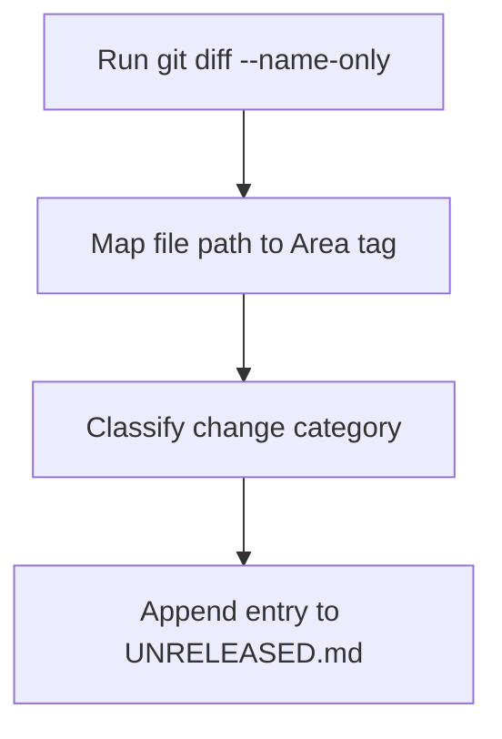

# /add-changelog-entry

Append a changelog entry to `UNRELEASED.md` based on the current `git diff` or recent file modifications.

## Process



1. Run `git diff --cached --name-only` or `git diff --name-only` to list every modified file path under `src/` and `tests/`. The file paths from `git diff` determine both the `[Area]` tag and the `### [Category]` heading for the changelog entry.

2. Map each changed file path to its `[Area]` tag:
   - `src/reporails_cli/interfaces/cli/` → `[CLI]`
   - `src/reporails_cli/core/` → `[CORE]`
   - `src/reporails_cli/bundled/` → `[BUNDLED]`
   - `src/reporails_cli/formatters/` → `[FORMATTERS]`
   - `README.md`, `docs/` → `[DOCS]`
   - `CLAUDE.md`, `.ails/backbone.yml`, `.claude/` → `[META]`

   Pick the area containing the primary behavioral change when changes span multiple areas. Ancillary files like `tests/` inherit the area of the `src/` module they exercise.

3. Select the `### [Category]` heading from the Keep a Changelog set based on what the diff shows:
   - `### Added` — new files, new functions, new `class` definitions not present before
   - `### Changed` — modified signatures, altered behavior in existing `src/` modules
   - `### Deprecated` — functions or flags marked for future removal
   - `### Removed` — deleted files, removed exports, dropped CLI flags
   - `### Fixed` — bug corrections where previous behavior was incorrect
   - `### Security` — vulnerability patches, dependency bumps for CVEs

   The category reflects user-visible impact. Use `### Changed` for internal refactors that preserve behavior.

4. Compose a 3-7 word description naming the specific construct affected (function name, module path, or CLI flag). Append the entry to `UNRELEASED.md` under the matching `### [Category]` heading — create the heading if it does not exist yet. Format each entry as:

   ```markdown
   ### Added
   - [CORE]: `validate_rule()` support for `content_query` checks
   ```

   Append the `UNRELEASED.md` entry without asking for confirmation. Prompting for approval adds friction without catching errors that `git diff` review would miss.

Target `UNRELEASED.md` exclusively when appending entries via this skill. `CHANGELOG.md` is read-only during development — the release workflow at `scripts/pre-release-check.sh` migrates entries at version-tag time.
