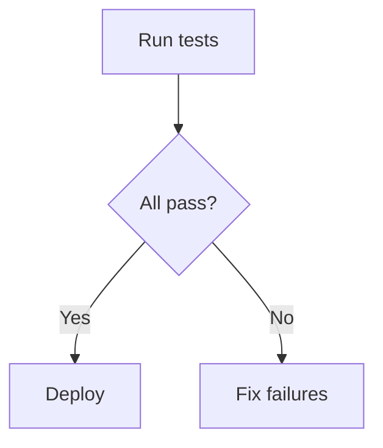

# Flowcharts for Procedures

Instruction files with branching workflows must include mermaid flowcharts. Numbered lists that contain conditional language ("if", "when", "otherwise") without an accompanying mermaid block indicate a procedure that would be clearer as a diagram.

## Antipatterns

- Writing a numbered list with "if X then do Y, otherwise do Z" steps but no mermaid block -- the check flags branching steps that lack a corresponding flowchart.
- Adding a mermaid block that shows a linear sequence while the prose describes branching -- the `has_branching_steps` check detects conditionals in numbered lists independent of the diagram content.
- Using prose paragraphs for conditional workflows instead of numbered lists -- the check specifically targets numbered lists with conditional keywords, so conditional paragraphs are not flagged but also not well-structured.

## Pass / Fail

### Pass

~~~~markdown


1. Run the test suite
2. If all tests pass, deploy to staging
3. Otherwise, fix failures and re-run
~~~~

### Fail

~~~~markdown
1. Run the test suite
2. If all tests pass, deploy to staging
3. Otherwise, fix the failures and re-run
4. When staging looks good, promote to production
~~~~

## Fix

For procedures with 3+ steps and branching logic, add a ` ```mermaid ` flowchart showing the control flow and all branch paths. Write prose below the flowchart explaining *why* each decision matters — the diagram shows what happens, the prose explains why.

Use numbered lists for linear sequences without branches. Do not add flowcharts to non-procedural content like tool constraints or project identity.

## Limitations

Detects numbered lists with conditional language ("if", "when", "otherwise") and checks for ` ```mermaid ` blocks. Uses `scope_conditional` atom classification to identify branching — may miss implicit branches not marked by conditional keywords. Does not verify that mermaid diagrams are syntactically valid or represent the described procedure.
