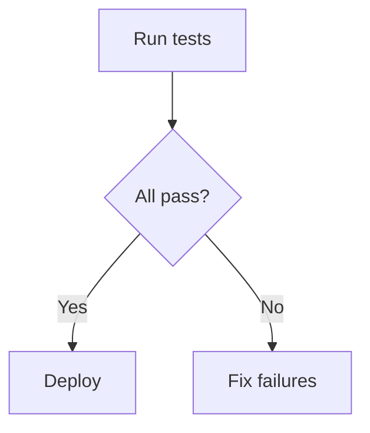

# Flowcharts for Procedures

Branching workflows read more clearly as a flowchart. When an instruction file spells out a multi-step procedure as a numbered list laced with conditional language ("if", "when", "otherwise"), the rule flags it as a candidate for a mermaid diagram. Files with no branching procedure are never flagged — the rule fires only where a branching numbered list is actually present, not on the mere absence of a diagram.

## Antipatterns

- Writing a numbered list with "if X then do Y, otherwise do Z" steps -- the rule flags the branching procedure and suggests adding a mermaid flowchart that shows the control flow and branch paths.
- Using prose paragraphs for conditional workflows instead of numbered lists -- the rule targets numbered lists with conditional keywords, so conditional paragraphs are not flagged (but are also not well-structured).

## Pass / Fail

### Pass

~~~~markdown

```mermaid
graph TD
    A[Run tests] --> B{All pass?}
    B -->|Yes| C[Deploy]
    B -->|No| D[Fix failures]
```

1. Run the test suite
2. If all tests pass, deploy to staging
3. Otherwise, fix failures and re-run
~~~~

### Fail

~~~~markdown
1. Run the test suite
2. If all tests pass, deploy to staging
3. Otherwise, fix the failures and re-run
4. When staging looks good, promote to production
~~~~

## Limitations

Fires only on files that contain a numbered list (three or more steps) with conditional language ("if", "when", "otherwise") — it flags the branching procedure itself, not the absence of a diagram, so files without a branching workflow are never flagged. It may miss implicit branches not marked by conditional keywords, and it does not confirm whether a matching diagram is already present or verify that any diagram is syntactically valid.
